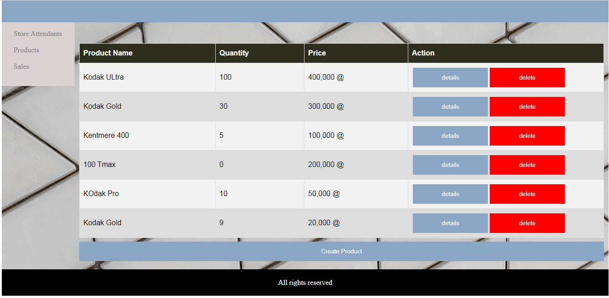

# StoreManager

## Description

Store manager is a web application that stores owners, manages sales and product inventory records. this application is meant for use in a single store

## FEATURES

- View products in the store
- view product details
- View product sales
- view sales details
- delete products and sales
- add new products and sales
- view list of store attendants

## Products Page

## Built With

- Python-Flask
- HTML5
- CSS3
- JavaScript

## Live Demo

[Live Demo Link](https://frankopkusianwar.github.io/StoreManager/UI/products1.html)

## Getting Started

To get a local copy up and running follow these simple example steps.

### Prerequisites

- python 3.7 -programming language that can be used on any mordern operating system

- Virtual environment -allows you to have an issolated evnvironment for your project where you can install all your dependencies

- Flask -a python framework for that can be used to add functionality to your API endpoints

## Instructions

- git clone https://github.com/frankopkusianwar/StoreManager.git
- cd StoreManager
- pip install virtualenv
- pip install virtualenvwrapper
- virtualenv venv
- source/venv/bin/activate
- python run.py

### Usage

- Now you can use the application

## Author

- Okiror Frank

👤 **Okiror Frank**

- Github: [@frankopkusianwar](https://github.com/frankopkusianwar)
- Twitter: [@franko0781](https://twitter.com/franko0781)
- Linkedin: [Okiror Frank](https://linkedin.com/in/frank-okiror)
- Email: okirorfrank3@gmail.com

## 🤝 Contributing

Contributions, issues and feature requests are welcome!

Feel free to check the [issues page](issues/).

## Show your support

Give a ⭐️ if you like this project!
